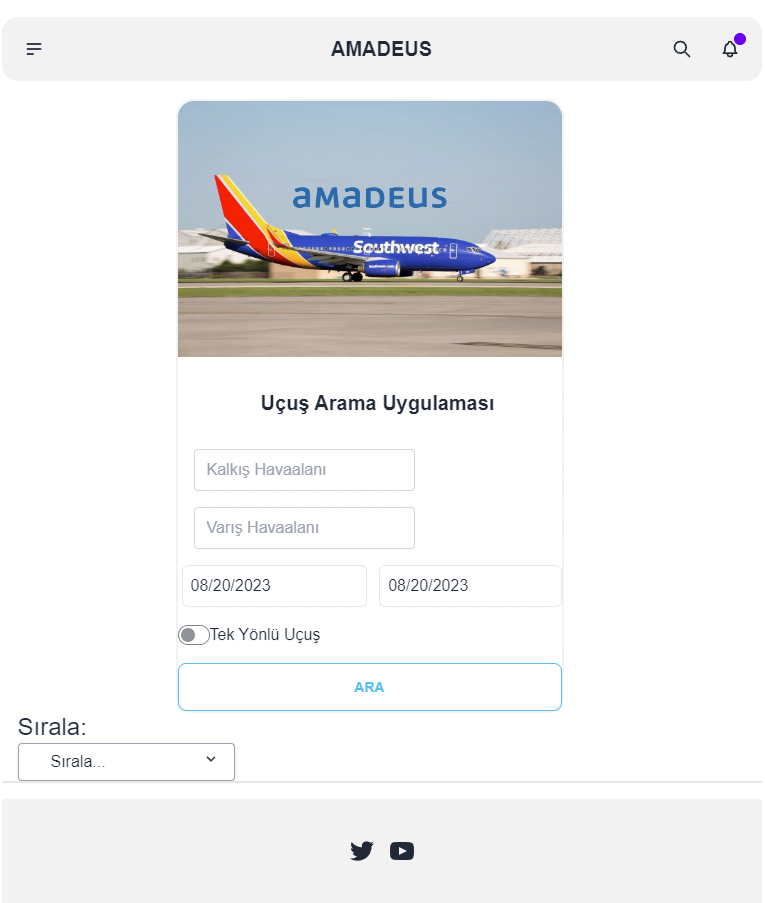

# Flight Search Application Documentation

## Table of Contents

1. [Introduction](#introduction)
2. [Components](#components)
    - [SearchBox](#searchbox)
    - [SearchForm](#searchform)
3. [Functions](#functions)
    - [haversineDistance](#haversinedistance)
    - [suggestDepartureAirports](#suggestdepartureairports)
    - [suggestArrivalAirports](#suggestarrivalairports)
    - [sortFlights](#sortflights)
    - [validate](#validate)
    - [handleSearch](#handlesearch)

## 1. Introduction

The Flight Search Application is a React-based web application that allows users to search for flights based on their departure and arrival preferences. The application provides a user-friendly interface for inputting search criteria and displays relevant flight results. This documentation outlines the major components and functions of the application.

## 2. Components

### SearchBox

The `SearchBox` component is the main interface of the application where users can input their flight search criteria. It manages the state of the search process, displays search results, and handles error handling.

### SearchForm

The `SearchForm` component is a child component of `SearchBox` responsible for rendering the search form. It receives input values and functions as props to manage the form's behavior. The component includes input fields for departure and arrival airports, date selection, and one-way flight option.

## 3. Functions

### haversineDistance(coords1, coords2)

Calculate the distance between two sets of coordinates using the haversine formula. The function takes two objects containing latitude and longitude values.

### suggestDepartureAirports(query)

Provide suggestions for departure airports based on the user's input query. The function filters the list of unique airports using the provided query and updates the departureSuggestions state.

### suggestArrivalAirports(query)

Similar to `suggestDepartureAirports`, this function suggests arrival airports based on the user's input query.

### sortFlights(flights)

Sort an array of flight objects based on the selected sorting option. The function uses the `sortOption` state to determine the sorting criterion and returns a new sorted array.

### validate()

Perform form validation to ensure that all required fields are filled correctly. The function sets error messages in the `errors` state object and returns a boolean indicating whether the form is valid.

### handleSearch()

Initiate the flight search process. This function is triggered when the user clicks the search button. It validates the form inputs, simulates a loading state, and then filters the `mockFlights` data to find relevant flight results based on the search criteria.
